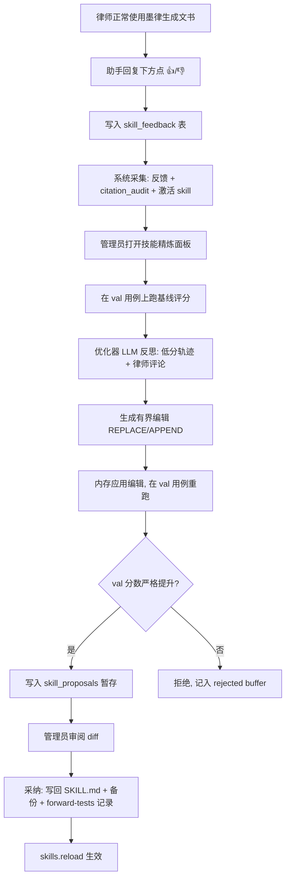

# 墨律技能精炼（SkillOpt）使用说明

> **生产环境**律师反馈走 [FEEDBACK_OPS.md](./FEEDBACK_OPS.md)（同步服务 + `feedback-refinement` SKILL），不在律师 App 内跑管理面板。本文档主要供 **dev 单机调试** 与理解评分/有界编辑原理。

> 本文档说明墨律 Inkstatute 内置的 **SkillOpt 技能自我进化** 功能：它是什么、原理如何、谁该做什么、日常怎么操作。

---

## 一、这个功能是什么

墨律的法律能力来自 `vendor/ai-for-china-legal` 里数百个 `SKILL.md` 技能文档（检索闸门、诉讼方案、合同审查等）。这些文档本质是 **自然语言指令**，不是模型权重。

**SkillOpt 技能精炼** 把 SkillOpt / SkillOpt-Sleep 的思路落地到本 App：

- **不动 LLM 权重**，只优化 `SKILL.md` 文本；
- 用真实使用反馈 + 自动化评分，找出 skill 的薄弱点；
- 由优化器 LLM 提出 **有界编辑**（增删改段落）；
- 在 **留出验证用例** 上重跑，只有分数 **严格变好** 才接受；
- 接受的改动先 **暂存为提案**，管理员审阅后再写回 skill 文件。

一句话：**律师正常用、顺手点反馈；系统在后台把 skill 文档越改越准，且改之前必须过闸门。**

---

## 二、和 Microsoft SkillOpt 的关系

| 概念 | SkillOpt 论文/开源 | 墨律实现 |
|------|-------------------|---------|
| 可训练状态 | `SKILL.md` 全文 | 同上，`vendor/ai-for-china-legal/**/SKILL.md` |
| 优化器 | 独立 LLM 做 reflect + 编辑 | 用你配置的 LLM（可选 fast 模型） |
| 回放 | 在 benchmark 上 rollout | `run_turn_core` 无头回放（真实工具循环） |
| 闸门 | val 集严格提分才接受 | `skillopt_gate=on` 时 val 分数必须 > 基线 |
| 部署产物 | `best_skill.md` | 审阅采纳后的 SKILL.md + `.skill-backups/` 备份 |
| 睡眠循环 | 离线 harvest → reflect → gate → adopt | 管理员面板触发 + 可选启用提示 |

参考：[Microsoft SkillOpt](https://github.com/microsoft/SkillOpt)

---

## 三、原理：完整闭环



### 3.1 三类信号（混合打分）

法律输出没有唯一标准答案，所以用 **混合奖励**：

```
总分 = w_human × 人工反馈 + w_rubric × LLM评委 + w_cite × 引用核验率
```

| 信号 | 来源 | 作用 |
|------|------|------|
| **人工反馈** | 律师 👍/👎 + 可选评论/维度 | 告诉优化器「哪里不对」；有反馈时权重更高 |
| **Rubric 评委** | LLM 对照 `gold-rubric.md` 打 R1–R10 | 国航案等结构化质量维度 |
| **引用核验** | `citations::audit`（verified/retrieved/unverified） | 法条是否可核验 |

默认权重（可在设置里改）：human 0.4 / rubric 0.45 / cite 0.15。无人工反馈时以 rubric + cite 为主。

### 3.2 有界编辑（不会整篇重写）

优化器只产出三种格式，避免 skill 被改乱：

| 格式 | 含义 | 示例 |
|------|------|------|
| `REPLACE:旧文本\|\|\|新文本` | 替换一段 | 改检查清单某条 |
| `APPEND:段落` | 末尾追加 | 加检索步骤 |
| `FULL:全文` | 整篇替换（极少用） | 仅极端情况 |

**低风险编辑**（改 references、checklist、检索步骤）在开启 `auto_adopt=low_risk` 时可能自动采纳；涉及「案由、法律依据、请求权」等法律结论的编辑 **默认必须人工审**。

### 3.3 验证闸门（防过拟合）

- **val 用例**：真实任务，用于决定是否接受编辑（gate on 时必须严格提分）；
- **test 用例**：观测用，不参与单次 accept/reject；
- **train 用例**：可含 dream 增强，只用于反思，**永不进入 val/test**。

种子用例：**国航重庆诉双业担保案**（`guohang-chongqing-shuangye`），材料目录：

```
C:\Users\sorawatcher\workspace\cn-lawyer-docs-skill\learning-materials\guohang-chongqing-shuangye\case-materials\案件资料
```

评测材料路径在 **评测数据根**（`skillopt_eval_data_roots`）里配置，与律师日常的 `allowed_file_dirs` **分开**，律师界面不可见。

### 3.4 数据存哪里

| 存储 | 内容 |
|------|------|
| SQLite `skill_feedback` | 每条消息的 👍/👎、评论、关联 skill |
| SQLite `eval_cases` | 测试用例（prompt、材料路径、rubric、split） |
| SQLite `eval_runs` | 每次跑分的分数、rubric 明细、tokens |
| SQLite `skill_proposals` | 暂存提案（diff、val_before/after、理由、状态） |
| `app_settings` | gate、auto_adopt、weights、budget、eval_data_roots |
| `<skills_root>/.skill-backups/` | 采纳前自动备份原 SKILL.md |
| `forward-tests.md` | 采纳后追加一行回归记录 |

---

## 四、角色分工：谁看到什么

### 律师（终端用户）

**只能做两件事：**

1. 正常使用墨律生成诉讼方案、合同审查等；
2. 在 **每条助手回复下方** 点 👍 或 👎，可选填一句话 + 维度标签（案由 / 法条 / 结构 / 检索 / 其他）。

律师 **看不到** 任何「评测用例、优化运行、提案审阅」入口。

### 管理员 / 开发者（你）

通过隐藏面板完成：采集、评分、闸门、提案、采纳。

| 快捷键 | 面板 |
|--------|------|
| `Ctrl+Shift+D` | 后台执行跟踪（原有） |
| `Ctrl+Shift+O` | **技能精炼**（SkillOpt 管理） |

---

## 五、操作指南

### 5.1 律师侧：提交反馈

1. 完成一次对话，等助手回复生成完毕（流式结束后才显示反馈按钮）；
2. 觉得满意 → 点 **👍**；
3. 觉得有问题 → 点 **👎**，可展开填写说明，勾选维度标签；
4. 提交后显示「已标记：有帮助 / 需改进」，刷新会话后仍在。

反馈会自动关联本轮 **激活的 skill 名**（写在消息 metadata 里）。

### 5.2 管理员侧：首次配置

1. 启动 App：`bun run tauri dev`；
2. 进入工作区，按 **`Ctrl+Shift+O`** 打开「技能精炼（管理员）」；
3. 切到 **「设置」** 标签：
   - **启用技能精炼**：勾选；
   - **闸门**：建议保持「开启（严格提分）」；
   - **自治采纳**：建议先用「关闭」，熟悉流程后再开「仅低风险」；
   - **Token 预算**：默认 100000，控制一次优化循环的 API 花费上限；
   - **评测数据根**：确认包含国航案件资料目录（见上文路径）；
4. 点 **保存设置**。

### 5.3 管理员侧：跑基准测试

1. **「测试用例」** 标签 → 点 **「导入国航种子用例」**（首次）；
2. 对 `guohang-chongqing-shuangye` 点 **「运行」**；
3. 等待无头回放完成（会调 LLM + 工具，较耗时）；
4. 查看得分与 rubric 明细（存在 `eval_runs` 表）。

这一步建立 **基线分数**，后续优化是否被接受都相对此基线。

### 5.4 管理员侧：启动优化循环

1. **「优化运行」** 标签；
2. 可选填 **目标技能**（如 `matter-intake`），留空则处理前几个 skill；
3. **干跑** 建议先勾选（只跑 reflect + gate，**不写提案文件**）；
4. 点 **「启动技能精炼」**；
5. 下方日志会显示：`reflect` → `gate_reject` / `dry_run_accept` → `complete` 等阶段。

确认干跑结果合理后，**取消勾选干跑** 再跑正式循环，会在 **「提案审阅」** 产生 `staged` 提案。

### 5.5 管理员侧：审阅与采纳

1. **「提案审阅」** 标签，查看每条提案：
   - 目标 skill 路径；
   - `val_before → val_after` 分数变化；
   - 修改理由；
   - diff 预览（REPLACE/APPEND 内容）；
2. 满意 → **采纳**：写回 `SKILL.md`，备份到 `.skill-backups/`，追加 `forward-tests.md`；
3. 不满意 → **拒绝**。

**注意**：`vendor/ai-for-china-legal` 是 git 子模块，采纳后需在子模块目录内 **单独 commit**，主仓库不会自动提交 skill 变更。

### 5.6 从反馈自动沉淀用例（可选）

**「反馈箱」** 标签 → **「从反馈沉淀用例」**：

- 👍 的真实会话 → 回归锚点（split=val/test）；
- 用于扩大验证集，无需律师手动管理用例。

---

## 六、推荐工作流（给指定律师做测试时）

若安排一位律师协助验证优化效果，只需极简步骤：

| 步骤 | 律师做什么 | 系统做什么 |
|------|-----------|-----------|
| 1 | 新开 session，用 **最小提示词** 生成诉讼方案 | 正常跑 skill + research-gate |
| 2 | 对照结果点 👍/👎，👎 时写一句「案由错了」等 | 写入 feedback |
| 3 | （可选）再跑 2～3 个真实案件 | 积累反馈 |
| 4 | — | 管理员 `Ctrl+Shift+O` → 跑国航用例 → 启动精炼 → 审阅采纳 |
| 5 | 律师 **新开 session** 重测同一类案件 | 验证 skill 是否变好 |

律师全程 **不需要** 打开管理面板或理解 SkillOpt 术语。

---

## 七、设置项说明

| 设置项 | 可选值 | 建议 |
|--------|--------|------|
| `skillopt_enabled` | 开/关 | 开发阶段可关，正式收集反馈后开 |
| `skillopt_gate` | on / off | **on**：只有 val 严格提分才接受；off 贪婪模式仍记录分数 |
| `skillopt_auto_adopt` | off / low_risk / all | 默认 **off**；low_risk 仅自动采纳检查清单类改动 |
| `skillopt_budget_tokens` | 数字 | 一次循环 API token 上限，用尽后干净停止 |
| `skillopt_eval_data_roots` | 路径列表 | 评测专用，含国航 `案件资料` 目录 |
| `skillopt_weights` | human/rubric/cite | 混合打分权重 |

---

## 八、代码位置（开发者参考）

```
src-tauri/src/skill_opt/          # 引擎：runner / judge / score / optimizer / proposals
src-tauri/src/commands/skillopt.rs # Tauri 命令
src-tauri/migrations/004_skill_opt.sql
src/components/workspace/MessageFeedback.tsx      # 律师反馈 UI
src/components/workspace/SkillRefinementPanel.tsx # 管理员面板 (Ctrl+Shift+O)
src/services/api.ts                 # 前端 invoke 封装
vendor/ai-for-china-legal/learning-materials/guohang-chongqing-shuangye/evaluation/gold-rubric.md
```

---

## 九、常见问题

**Q：律师点了 👎，skill 会自动改吗？**  
A：不会。👎 只进入反馈库；必须管理员在面板里跑精炼 + 审阅采纳后才会改文件。

**Q：干跑和正式跑的区别？**  
A：干跑只验证「reflect + gate 是否接受」，不写 `skill_proposals`、不改磁盘 skill。

**Q：为什么要有国航种子用例？**  
A：闸门需要 **可重复运行的真实任务 + rubric**。国航案是已知的失败样本（案由/主体资格陷阱），有完整 R1–R10 评分标准。

**Q：采纳后律师要重启 App 吗？**  
A：采纳会 `skills.reload()`，新 session 即用新 skill；已开 session 建议新开对话。

**Q：API 费用谁承担？**  
A：优化循环用你在设置里配置的 LLM（主模型或 fast 模型），在管理员触发时离线消耗，不在律师每次聊天时额外调用优化器。

**Q：和 `Ctrl+Shift+D` 跟踪面板什么关系？**  
D 看单次对话的 agent 轨迹；O 看跨会话的 skill 进化与提案。互不替代。

---

## 十、安全与默认策略

- **法律结论类编辑** 默认必须人工审（除非 `auto_adopt=all`，不推荐生产使用）；
- **闸门默认开启**，防止 skill 越改越差；
- **采纳前自动备份** 到 `.skill-backups/<时间戳>/`；
- **评测材料路径** 与律师文件沙箱隔离，避免误暴露案卷目录配置给终端用户。

---

*文档版本：与当前 `lawyer-desktop` 代码同步。如有行为差异，以 `src-tauri/src/skill_opt/` 实现为准。*
